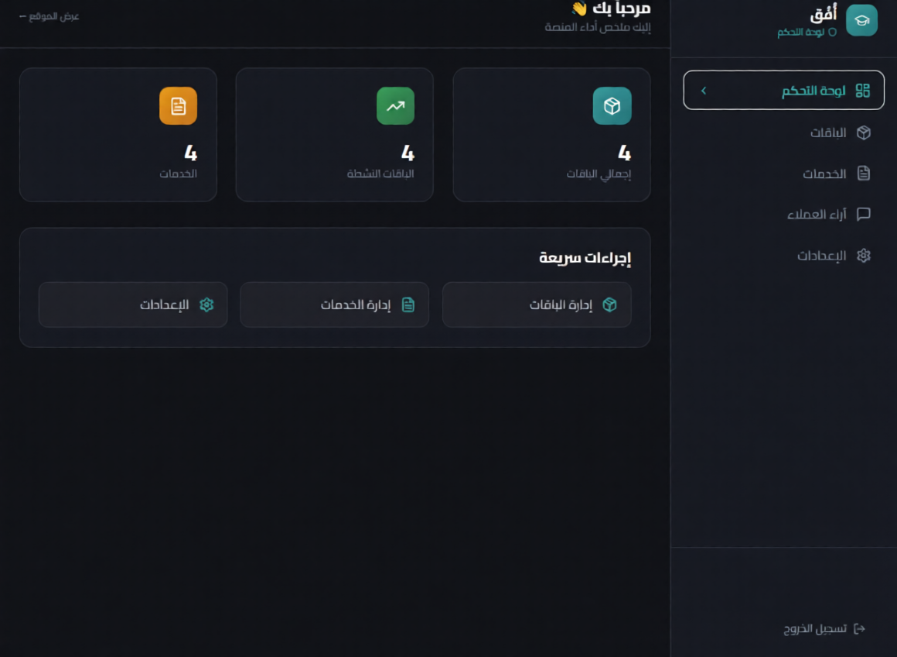
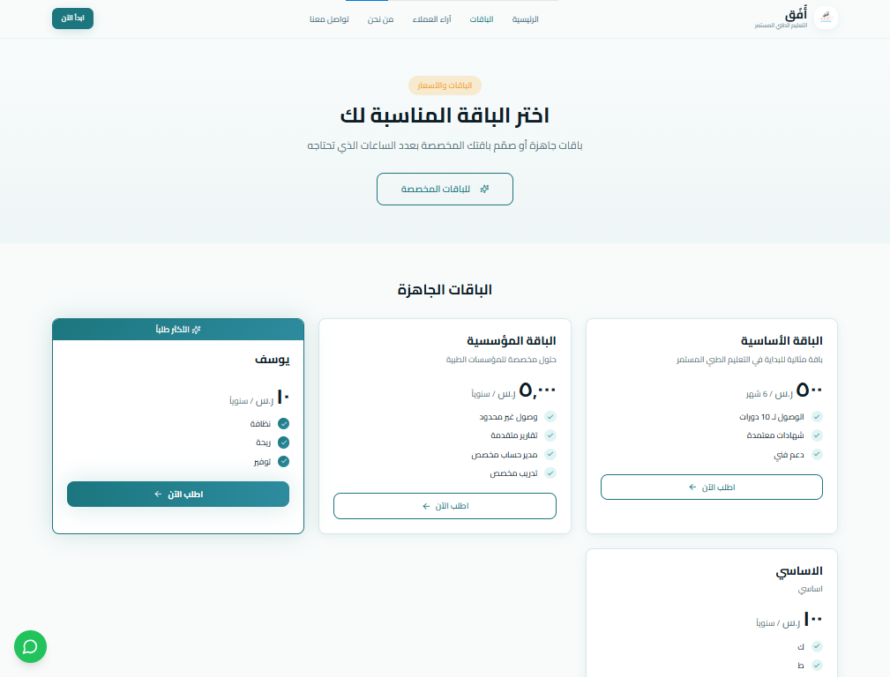

🚀 منصة أُفُق | Ofuq Platform

[زيارة المنصة](https://ofuc-cme.vercel.app/)
[الحالة: Production](https://ofuc-cme.vercel.app/)

---

🌟 مقدمة

أُفُق هي منصة SaaS متكاملة لإدارة الخدمات والتدريب الصحي، مصممة للشركات والمؤسسات لتسهيل العمليات اليومية، متابعة الأداء، وإدارة المستخدمين بكفاءة.
تم تصميم المنصة لتكون سهلة الاستخدام، مرنة، وقابلة للتوسع حسب احتياجات المؤسسة.

---

🖼️ لمحة بصرية للمنصة

واجهة المستخدم الرئيسية:

لوحة تحكم المسؤول (Admin Dashboard):

إدارة المستخدمين والبيانات:

---

🛠️ التقنيات المستخدمة

الطبقة | التقنية
Frontend | React + TypeScript + Vite
UI/UX | shadcn-ui + Tailwind CSS
Backend / Database | Supabase
Deployment | Vercel

---

⚡ المميزات الرئيسية

* إدارة متقدمة للمستخدمين: التحكم في الصلاحيات والأدوار بسهولة
* لوحة تحكم Admin Dashboard: واجهة احترافية لتتبع الأداء وإدارة العمليات
* تكامل كامل مع Supabase: لتخزين البيانات بطريقة آمنة وفعّالة
* دعم RTL للغة العربية: واجهة مناسبة للمستخدمين العرب
* نشر سريع على Vercel: كل التحديثات تنعكس تلقائياً على النسخة الحية

---

📂 هيكل المشروع

ofuq-admin-hub-main/

* public/                  - ملفات ثابتة
* src/                     - ملفات الواجهة الأمامية
* supabase/                - سكريبتات وقاعدة البيانات
* .gitignore               - استبعاد ملفات من Git
* package.json             - إدارة الاعتماديات
* tsconfig.json            - إعدادات TypeScript
* vite.config.ts           - إعدادات Vite
* README.md                - هذا الملف

---

🚀 تشغيل المشروع محلياً

تأكد من تثبيت Node.js و npm، ثم نفذ الخطوات التالية:

git clone <YOUR_GIT_URL>
cd ofuq-admin-hub-main
npm install
npm run dev

---

🔧 النشر على Vercel

1. اربط المستودع بـ Vercel
2. كل push على GitHub سيقوم بتحديث النسخة الحية تلقائياً
3. يمكنك إدارة النطاقات والإصدارات من لوحة تحكم Vercel بسهولة

---

👨‍💻 المطور

محمود | مطور المنصة ومالك المشروع
البريد الإلكتروني: [example@ofuq.com](mailto:example@ofuq.com)
GitHub: [ufuqcme-sudo](https://github.com/ufuqcme-sudo)

---

---

تحب أجهزها لك كده؟
